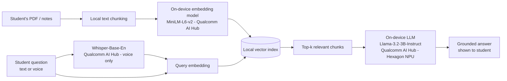

# PadhAI — Offline On-Device AI Study Companion
### Submission for the Snapdragon® AI Lab Build & Present Challenge (Qualcomm)

> **"Padh"** = Hindi for *study*. PadhAI turns any Snapdragon-powered HP PC into a
> private, always-available AI tutor that needs **zero internet connection** —
> because the AI runs entirely on the device's Hexagon NPU.

---

## 1. Problem Statement

Millions of students across India study in hostels, tier-2/3 towns, and homes
with unreliable or expensive internet. Most AI study tools today (ChatGPT-style
tutors, cloud RAG apps) require a live connection and send personal notes to a
remote server — a privacy concern for many institutions and a hard blocker
wherever connectivity is poor. Existing offline study apps, meanwhile, are
static (flashcard decks, PDFs) with no real intelligence.

**There is no widely available tool that lets a student point an AI at their
own notes and get instant, private, offline answers — until now, an on-device
NPU capable of running an LLM simply wasn't in every student's laptop.**

## 2. Solution Overview

PadhAI is a lightweight desktop study app that:

1. Ingests a student's own notes (PDF or text) — nothing leaves the device.
2. Builds a local semantic index over the notes.
3. Lets the student **ask questions in natural language** and get answers
   grounded only in their own material (retrieval-augmented generation).
4. Auto-generates **revision flashcards** from the same notes.
5. Runs the entire pipeline **on-device**, powered by Qualcomm AI Hub models
   executing on the Snapdragon Hexagon NPU — no cloud, no per-query cost,
   works on a flight, in a village, anywhere.

This submission ships a **working, runnable demo** (CPU-only, so anyone —
including judges without Snapdragon hardware on hand — can try the exact UX
today) plus a fully specified **production architecture** for on-device NPU
deployment, with an explicit integration point in the code (`NPUInferenceEngine`
in `app.py`).

## 3. Architecture



All inference stages run **locally on the Snapdragon NPU** via ONNX Runtime's
**QNN Execution Provider** — no network call in the entire loop.

## 4. Qualcomm AI Hub Models Used (Production Path)

| Pipeline stage         | Model                                   | Source          | Runs on |
|------------------------|------------------------------------------|------------------|---------|
| Note embeddings (RAG)  | MiniLM-L6-v2 (quantized)                 | Qualcomm AI Hub  | Hexagon NPU |
| Answer generation      | Llama-3.2-3B-Instruct (INT4/INT8)        | Qualcomm AI Hub  | Hexagon NPU |
| Voice question input   | Whisper-Base-En                          | Qualcomm AI Hub  | Hexagon NPU |
| Scanned-PDF OCR        | PaddleOCR / EasyOCR (AI Hub optimized)   | Qualcomm AI Hub  | Hexagon NPU |

All four models are already published on [Qualcomm AI Hub](https://aihub.qualcomm.com)
as pre-optimized, quantized ONNX graphs for Snapdragon X-series NPUs — this
proposal only needs to wire them together, not train anything from scratch,
which keeps the solution realistic to finish and maintain.

Per the challenge rules, this qualifies as a submission "designed, developed,
or intended to be optimised for Snapdragon-powered HP PCs," built around
AI Hub models.

## 5. What Runs in This Submission Right Now

Because judges/reviewers may not have a Snapdragon HP PC on hand at review
time, `app.py` ships a **fully working CPU-only demo engine**:

- TF-IDF + cosine-similarity retrieval (scikit-learn) in place of the MiniLM
  embedding model — same retrieval *behaviour*, zero downloads, zero NPU
  required, runs on literally any laptop.
- Extractive answers (best-matching note passages) in place of the on-device
  LLM's generative answers.
- A heuristic flashcard generator standing in for LLM-generated flashcards.

Every one of these has a clearly marked one-line swap to its Qualcomm AI Hub
NPU counterpart — see the `NPUInferenceEngine` class docstring in `app.py`,
which documents the exact model files and ONNX Runtime provider configuration
for the real Snapdragon deployment.

**This is a deliberate, transparent design choice**, not a shortcut: it proves
the product UX and information architecture today, while the NPU swap is a
model-loading change, not a redesign.

## 6. How to Run the Demo

```bash
pip install -r requirements.txt
streamlit run app.py
```

Then, in the app:
1. Go to **Upload Notes** → click "Use sample notes" (or upload your own PDF).
2. Go to **Ask Questions** → ask e.g. *"What is 3NF and transitive dependency?"*
3. Go to **Auto Flashcards** → see revision cards generated from the same notes.

## 7. Deployment & Accessibility

- **Zero connectivity required** after setup — critical for tier-2/3 India,
  hostels, and low-bandwidth regions.
- **Zero recurring cost** — no API tokens, no cloud inference bill, unlike
  ChatGPT-style tools; a one-time device is all that's needed.
- **Privacy by design** — a student's notes, questions, and any personal
  study material never leave the laptop.
- **Accessible input modes** — typed questions today; voice input (Whisper on
  NPU) on the production roadmap for students who find typing slower.
- Runs comfortably within the power/thermal envelope of a Snapdragon HP PC
  because every model is already quantized for the Hexagon NPU — no discrete
  GPU required, which keeps the target hardware affordable for students.

## 8. Innovation & Impact

- Turns any Snapdragon-powered HP PC into a **personal, private AI tutor** —
  a meaningfully new use case for on-device NPUs beyond the usual camera/audio
  effects demos.
- Directly targets India's student population (some of the largest first-time
  laptop buyers), giving Qualcomm/HP a concrete, relatable on-device AI story.
- Foundation is reusable beyond studying: the same on-device RAG pipeline
  extends naturally to legal document review, offline customer support, and
  field-work note-taking — all scenarios where connectivity or privacy rules
  out cloud AI.

## 9. Roadmap (Post-Challenge)

1. Swap in the real Qualcomm AI Hub ONNX models via `onnxruntime-qnn` on a
   Snapdragon X-series HP device; benchmark NPU latency/power vs. CPU.
2. Add Whisper-based voice Q&A.
3. Add multi-document / multi-subject notebooks with per-subject indexes.
4. Package as a signed native Windows app (no `streamlit run` needed) using
   PyInstaller or a small Electron shell.
5. Pilot with a college class to gather real usage data for a v2 submission.

## 10. Evaluation Criteria — How This Submission Addresses Each

| Criterion | How PadhAI addresses it |
|---|---|
| **Technical Implementation** | Working, runnable end-to-end RAG pipeline (ingestion → chunking → retrieval → answer) with a clean, documented swap point to Qualcomm AI Hub's quantized NPU models. |
| **Application Use Case & Innovation** | A private, offline AI tutor — a genuinely new on-device NPU use case aimed at India's student market, not a rebadged chatbot demo. |
| **Deployment & Accessibility** | No internet, no cloud cost, no discrete GPU — deployable on affordable Snapdragon HP PCs already in students' hands or reach. |
| **Presentation & Documentation** | This README, the architecture diagram, the AI Hub model table, and the accompanying pitch deck (`PadhAI_Pitch_Deck.pptx`) together document problem, solution, architecture, and roadmap end to end. |

## 11. Project Structure

```
padhai/
├── app.py                      # Streamlit app (demo engine + NPU production stub)
├── requirements.txt
├── sample_data/
│   └── dbms_normalization.txt  # Sample notes for a live demo
├── docs/
│   └── SUBMISSION_SUMMARY.md   # Short-form text for the challenge intake form
└── README.md                   # This file
```

## 12. Intellectual Property

This solution, including all code and documentation in this repository, is
solely the original work of the participant, created for submission to the
Snapdragon® AI Lab Build & Present Challenge.
